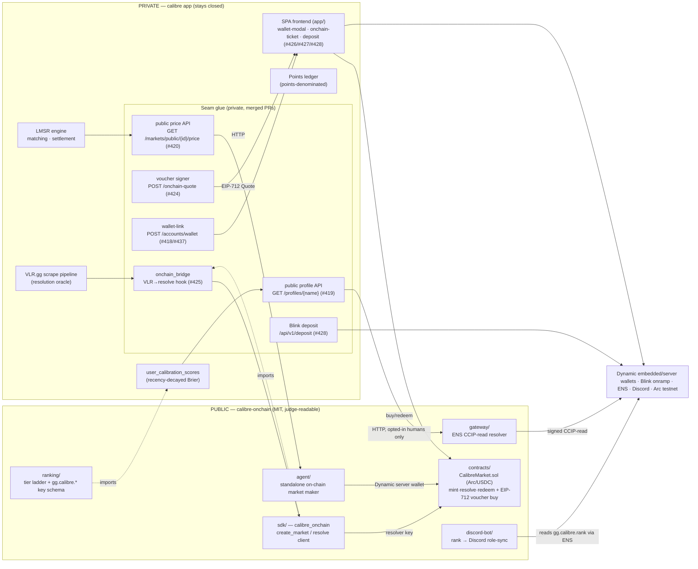
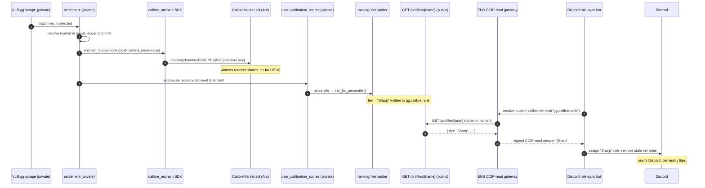
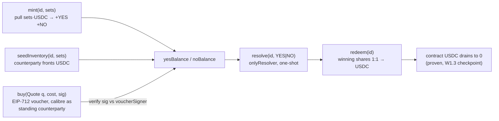

# Architecture — Calibre on-chain (ETHGlobal NYC 2026)

How the private **calibre** app and the public **`calibre-onchain`** repo fit
together, the four seams where they meet, and the hero data-flow that judges see
on screen.

**One sentence:** calibre's internal, points-denominated Valorant prediction
market gains an on-chain settlement layer — markets mirror onto an **Arc/USDC**
contract, users onboard with **Dynamic** wallets and fund via **Blink**, and a
portable forecasting reputation is served over **ENS** and consumed by a Discord
role-sync bot. The LMSR pricing engine stays off-chain (custody model
**A-lite**); the chain handles mint / resolve / redeem with calibre as the
standing EIP-712 counterparty.

> **Status legend used throughout:** ✅ built-and-tested (merged) · 🔌
> `[OWNER-FILL]` live deploy / credential gated (code complete, awaiting a
> deployed address, funded wallet, real Dynamic environment, or booth-designated
> ENS resolver — see calibre#440 "Owner-blocked / open").

---

## 1. System context — private vs public

The dividing line: **`calibre-onchain` develops APIs / services / contracts; the
private calibre app owns all UI and consumes them.** Public components never
import private code and never touch the database; private code imports the public
`sdk/` and `ranking/` packages. Dependency direction is strictly one-way.

**What stays private (never in `calibre-onchain`):** the LMSR engine
(`lmsr.py`), matching engine, settlement internals, the bot fleet
(`behavior.py` + archetypes + dispatcher), the VLR / Liquipedia scrapers, the
Polymarket collector/anchor stack, the admin surface, and all deploy/infra. The
public repo exposes the *interfaces* the private app calls — never the
proprietary engine.

---

## 2. The four seams

These are the only places the two repos meet. Each is a judged surface.

| Seam | Direction | Interface | Implemented by |
|---|---|---|---|
| **1 — resolution → on-chain resolve** | private → public SDK | `sdk.create_market(id)` / `sdk.resolve(id, outcome)`, signed by the resolver key. Post-commit, off the hot path, **never-raise**. | contract `createMarket`/`resolve` ✅; `sdk/` ✅; private hook `onchain_bridge.py` (#425) ✅ |
| **2 — public profile API** | public services → private app | `GET /api/v1/profiles/{display_name}` → tier / brier / roi / pnl / wallet / discord / riot / clan — opted-in **humans only**, never positions or `is_bot` | profiles API (#419) ✅; consumed by gateway ✅ + discord-bot ✅ |
| **3 — wallet identity** | Dynamic ↔ accounts | `POST /api/v1/accounts/wallet` verifies the Dynamic JWT, binds `users.wallet_address`; SPA connect-flow | wallet-link (#418) ✅ + hardening (#437) ✅; SPA mount (#426) ✅ |
| **4 — on-chain agents** | public agent → private price feed | `GET /api/v1/markets/public/{id}/price` (YES micro-cents + metadata) as the agent's prior; the agent quotes from its own Dynamic server wallet | price API (#420) ✅; `agent/` (#432/#444) ✅ |

```mermaid
flowchart TB
  subgraph S1["Seam 1 · settlement"]
    a1["settlement._resolve_market<br/>(private, on points resolve)"] -->|never-raise hook| a2["onchain_bridge (#425)"]
    a2 -->|calibre_onchain SDK| a3["CalibreMarket.resolve(id, YES|NO)<br/>resolver key"]
  end
  subgraph S2["Seam 2 · reputation"]
    b1["user_calibration_scores"] --> b2["ranking.tier_for_percentile"]
    b2 --> b3["GET /profiles/{name}<br/>opted-in humans only"]
    b3 -->|HTTP| b4["ENS gateway · Discord bot"]
  end
  subgraph S3["Seam 3 · wallet identity"]
    c1["Dynamic embedded wallet"] -->|JWT| c2["POST /accounts/wallet (#418/#437)<br/>verify JWKS · bind wallet_address"]
  end
  subgraph S4["Seam 4 · on-chain agent"]
    d1["GET /markets/public/{id}/price (#420)"] -->|prior| d2["agent/ maker"]
    d2 -->|Dynamic server wallet| d3["CalibreMarket buy/mint"]
  end
```

### Seam 1 detail — never-raise settlement mirror

`onchain_bridge.py` (#425) hooks at `settlement._resolve_market`, **after** the
points commit, flag-gated `ONCHAIN_RESOLVE_ENABLED` (default OFF). A chain
failure leaves the `onchain_markets` row `pending` for retry on the next
lifecycle tick and **never blocks or rolls back points settlement** — proven by
`test_points_settle_even_when_sdk_raises`. The outcome enum is **YES=1 / NO=2**
(UNRESOLVED=0 reverts), matching `CalibreMarket.Outcome`.

### Seam 3 detail — Dynamic JWT verification

`POST /api/v1/accounts/wallet` (#418) verifies the Dynamic-issued JWT against the
JWKS at `app.dynamic.xyz/<environment_id>` (RS256 pinned, 1h TTL cache with
kid-miss self-heal). The **verified address comes from `verified_credentials[]`
only — never client-supplied**, lowercased before persist. Hardening (#437)
added opt-in `aud` verification (gated on `DYNAMIC_JWT_AUDIENCE`) and a global
one-wallet-per-user partial unique index (race-safe 409 on a cross-user
collision). The user UUID stays canonical; the wallet is identity metadata, like
email.

---

## 3. The hero data-flow — on-chain → ENS → Web2 in one motion

The demo closer: a Valorant match resolves, that resolution settles the market
on Arc, the user's recomputed rank is written as an ENS text record (free, via
CCIP-read), and a Discord bot reading that record flips the user's role on
screen — seconds later.

**Why ENS is load-bearing, not cosmetic:** rank changes on *every* resolution;
writing it on-chain per-update is cost-prohibitive. The offchain resolver
(ENSIP-10 / CCIP-read, EIP-3668) makes "updating a text record" == updating the
calibre DB — free and instant, yet resolvable by **any** ENS-aware client. The
Discord bot reads `gg.calibre.rank` with a **standard ENS library** (viem
`getEnsText`, zero calibre-API calls) — ENS is the credential layer between
calibre and Discord, not a mirror. The bot assigns **rank-tier roles only**, no
position/ROI/Brier leakage (asserted by a privacy test).

---

## 4. The Arc settlement contract (`CalibreMarket.sol`)

Complete-set design: **1 USDC mints 1 YES + 1 NO share**, so the contract is
solvent by construction — no separate house-capitalization step. The LMSR
pricing engine is **never** ported to Solidity; on-chain is custody + settlement
only.

**A-lite differentiator (the voucher path):** price discovery stays in the
off-chain LMSR. The contract verifies an **EIP-712 `Quote`** signed by
`voucherSigner` — `Quote(uint256 marketId, address buyer, uint8 side,
uint256 size, uint256 maxCost, uint256 nonce, uint256 expiry)` — then atomically
pulls USDC from the buyer and moves shares from pre-minted `counterparty`
inventory. Per-buyer monotonic nonce (replay protection), `≤30s` expiry,
`cost ≤ maxCost` slippage ceiling, and an optional per-market notional cap
(`~1000 USDC`, belt-and-suspenders against a compromised signer). Because shares
move from already-backed inventory, the complete-set solvency invariant is
unchanged by a buy.

**Decimals safety (W8 spike §3):** `usdcUnit` is read from `token.decimals()` at
construction, so accounting respects Arc's 6-decimal ERC-20 USDC and never
touches the 18-decimal native gas asset.

**Backend signer interop:** the private voucher signer (#424) was caught at
review encoding the wrong typed data (`Voucher`→`Quote`, missing `buyer`,
inverted `side`) and fixed pre-merge; digest byte-equality against the deployed
contract's `hashQuote` is now verified cross-language. The on-chain agent's buy
leg (#444) re-verifies the same `hashQuote` parity with forge.

---

## 5. The Saturday-noon custody checkpoint (W1.3, #423)

A broadcastable `forge script` (`script/EndToEnd.s.sol`) — not a unit test —
sends the entire A-lite round-trip as real transactions and `require`s every
invariant, so the run itself is the pass/fail signal.

**Verdict: PASS — custody stays Model A-lite.** Verified on a local anvil chain
(2026-06-12): deploy → `seedInventory` → EIP-712 voucher-signed `buy` (YES+NO) →
`resolve(YES)` → `redeem` (buyer + counterparty residual) → contract USDC drains
to exactly **0**, total conserved (200), buyer net **+30** on 30 winning shares.
Confirmed by independent `cast` reads, not just script asserts. 28 `forge test`
cases stay green (33 in the agent package after the voucher swap).

The canonical proof runs on local anvil (deterministic); the **live Arc run is an
RPC + funded-key swap** — owner/booth-gated, documented in the README.
🔌 `[OWNER-FILL: live Arc deploy address + broadcast tx]`.

---

## 6. Configuration / feature flags

Every leg is one env flag from dormant — nothing breaks the points app when off.
All gates default **OFF**; secrets are placeholders until live deploy.

| Flag (private `Settings` / `deploy/env.example`) | Gates |
|---|---|
| `ONCHAIN_RESOLVE_ENABLED` + `ONCHAIN_CONTRACT_ADDRESS` / `ONCHAIN_RPC_URL` / `ONCHAIN_RESOLVER_KEY` / `ONCHAIN_CHAIN_ID` (5042002) | Seam 1 resolve mirror |
| `VOUCHER_SIGNER_ENABLED` + `VOUCHER_SIGNER_KEY` / `VOUCHER_TTL_S` / `VOUCHER_MAX_COST_MULTIPLIER_BPS` / `VOUCHER_MAX_NOTIONAL_USDC` | A-lite voucher signer |
| `DYNAMIC_ENABLED` + `DYNAMIC_ENVIRONMENT_ID` / `DYNAMIC_API_KEY` / `DYNAMIC_JWT_AUDIENCE` | Dynamic wallet onboarding |
| `BLINK_ENABLED` + `BLINK_DESTINATION_MODE` / `BLINK_API_KEY` / `BLINK_WEBHOOK_SECRET` | Blink deposit |

🔌 The deployed Arc address, a funded Arc wallet, a real Dynamic environment, the
deployed ENS resolver + booth-designated parent name, and the exact Blink
destination param are all **owner/booth-gated** (calibre#440). The code paths are
complete and merged; they activate on configuration.
